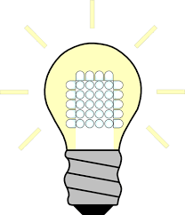

<!DOCTYPE html>
<html>
<head>
    <meta charset="utf-8">
    <title>Wesley Valdes</title>
    <link rel="stylesheet" href="css/styles.css" />
    <link rel="icon" href="favicon.ico" />
    <link href="https://fonts.googleapis.com/css2?family=Merriweather&family=Montserrat&family=Sacramento&display=swap" rel="stylesheet">
</head>
<body>
    

        Nav bar area
        <a class="social-link" href="https://www.linkedin.com/in/dr-wesley-valdes-a16b0918/">LinkedIn</a>
        <a class="social-link" href="https://www.linkedin.com/">GitHub</a>
        <a class="social-link" href="https://www.linkedin.com/">Project Portfolio</a>
    

    

        
        <h1>I'm Wes</h1>
        <h2>Searching for efficiency in a world of competing incentives</h2>
        
        
    

    

        

            
            <h2>Blah blah blah</h2>
        

        

            <h2>My Skills.</h2>
            

                
                <h3>Lorem & Ipsum</h3>
                
Stuf stuff stuff

            

            

                
                <h3>Lorem & Ipsum</h3>
                
Stuf stuff stuff

            

        

        

    

    

        <h3>Get in touch</h3>
    

    

        Bottom
    

    

        
Copyright 2020

    

</body>
</html>
